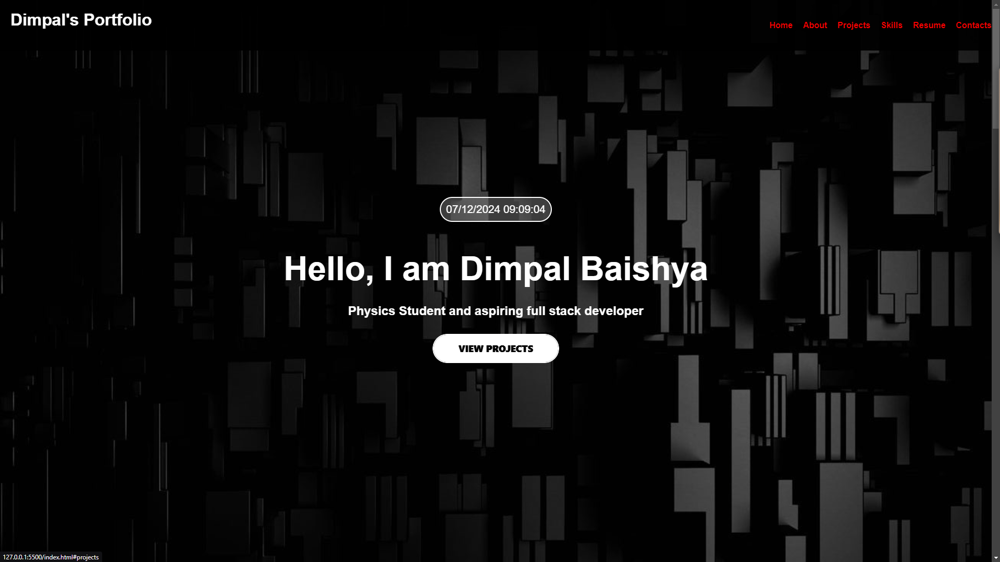
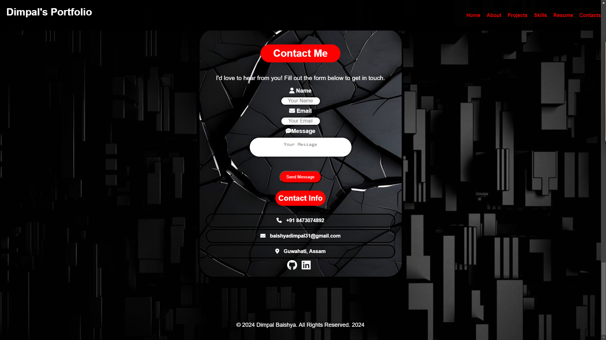

# Portfolio Website

## 📖 About the Project
This is a personal portfolio website designed to showcase my skills, projects, and achievements. It provides an overview of my journey as a web developer, the technologies I work with, and ways to connect with me.

## ✨ Features
- Clean and responsive design.
- **Smooth Navigation**: Easy-to-use layout with a clean interface.  
- **Interactive Elements**: Hover effects and animations to enhance user experience.
- "About Me" section to introduce myself.
- "Projects" section showcasing my work with live demo links.
- Contact form functionality to allow users to reach out.
- **Contact Form**: Integrated with Formspree for seamless message handling.
- Hosted and deployed on **Netlify**.
---
## 🔧 Built With
- **HTML5**
- **CSS3**
- **JavaScript**
- **Responsive Design (Flexbox/Grid)**
- **Formspree** (for contact form handling)
---

## 🛠️ Installation
To set up the project locally, follow these steps:
1. Clone this repository:
   ```bash
   git clone https://github.com/CornHaki/CodSoft_Task_1.git
2. Navigate to the project folder:
   ```bash
   cd CodSoft_Task_1
3. Open the ```index.html``` file in your browser to view the site.
    ```bash
   open index.html
   
---

## Screenshots 📸



---
## 📂 Folder Structure
```plaintext
CodSoft_Task_1/
│
├── .vscode/                   # VS Code workspace settings
│   └── settings.json          # Workspace settings configuration
├── assets/
│    ├── image1.png         
│    └── image2.png
├── 334ac08894c8d6879057b6cf07f055f9.jpg   # Image file 1      
├── 4f058b925e6089c1e5cdf09315644e66.jpg   # Image file 2
├── Dimpal_Baishya_Resume.pdf              # Resume file
├── README.md              # Documentation file
├── favicon-32x32.png
├── index.html                               # Main HTML file
├── script.js                                # Main JavaScript file
└── style.css                                # Main CSS file
 
```
## Author 🖋️
Dimpal Baishya
---

## *📬 Contact Me*
Feel free to connect with me:

📧 Email: baishyadimpal31@gmail.com
---
